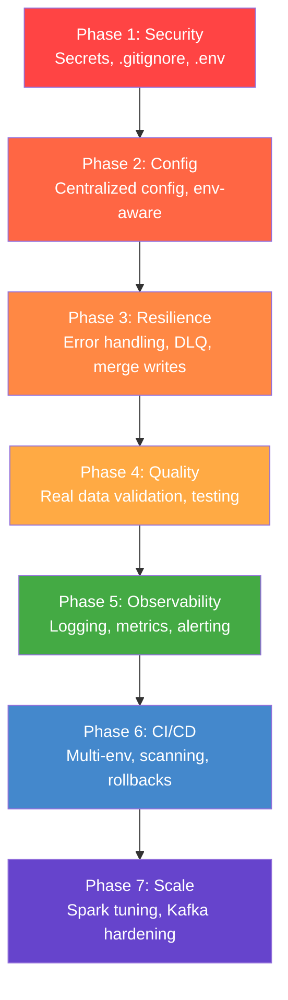

# 🏭 Retail Data Platform — Production Readiness Analysis

You've built a solid foundation — the Medallion architecture, Docker Compose orchestration, DAGs, streaming + batch pipelines, and a CI/CD skeleton are all in place. That said, this project is currently in **"working prototype"** territory. Below is a gap analysis organized by severity, showing exactly what needs to change to make this production-grade.

---

## Executive Summary — Current Maturity

| Dimension | Current Grade | Production Target |
|---|---|---|
| 🔴 Security & Secrets | **F** — hardcoded everywhere | Vault / env-based secrets |
| 🔴 Configuration Management | **D** — hardcoded strings | Centralized, environment-aware config |
| 🟡 Observability & Monitoring | **F** — `print()` only | Structured logging, metrics, alerting |
| 🟡 Data Quality | **F** — placeholder only | Real validation framework |
| 🟡 Error Handling & Resilience | **D** — bare-bones | Retries, DLQs, circuit breakers |
| 🟡 Testing | **D** — 2 trivial tests | Comprehensive unit + integration coverage |
| 🟠 CI/CD Pipeline | **C** — basic Jenkinsfile | Multi-env, image scanning, rollbacks |
| 🟠 Spark Tuning | **D** — no tuning at all | Resource governance, partitioning, caching |
| 🟠 Kafka Hardening | **D** — single broker, no ACLs | Schema registry, consumer groups, monitoring |
| 🟢 Documentation | **B** — decent structure | Runbooks, SLAs, incident playbooks |

---

## 🔴 CRITICAL — Fix Before Any Deployment

### 1. Hardcoded Secrets Everywhere

This is the #1 blocker. Every credential in the project is committed to version control in plaintext.

**Files affected:**
- [docker-compose.yml](file:///home/bhaskar/projects/retail-data-platform/docker-compose.yml#L4) — Postgres password `airflow:airflow`, Fernet key, MinIO creds
- [spark_session.py](file:///home/bhaskar/projects/retail-data-platform/src/shared/spark_session.py#L21-L22) — `minioadmin/minioadmin` hardcoded
- [Jenkinsfile](file:///home/bhaskar/projects/retail-data-platform/jenkins/Jenkinsfile#L7-L8) — MinIO keys in `environment` block
- [producer.py](file:///home/bhaskar/projects/retail-data-platform/src/kafka/producer.py#L11) — Kafka broker hardcoded
- [setup_minio.sh](file:///home/bhaskar/projects/retail-data-platform/scripts/setup_minio.sh#L3) — MinIO creds in shell script
- [docker-compose.yml L7](file:///home/bhaskar/projects/retail-data-platform/docker-compose.yml#L7) — `AIRFLOW__API__SECRET_KEY` in plaintext with a comment "ADD THIS"

> [!CAUTION]
> The Fernet key on [line 18](file:///home/bhaskar/projects/retail-data-platform/docker-compose.yml#L18) (`46BKJoQYlPPOexq0OhDZnIlNpKFCRPk0XQNYiWkZkPE=`) is committed to git. In production, this encrypts Airflow connection passwords. If leaked, all stored connections are compromised.

**Production fix:**
```
# Create .env file (add to .gitignore!)
POSTGRES_PASSWORD=<vault-managed>
MINIO_ROOT_USER=<vault-managed>
MINIO_ROOT_PASSWORD=<vault-managed>
AIRFLOW_FERNET_KEY=<generated-per-env>
AIRFLOW_SECRET_KEY=<generated-per-env>
```
- Use `docker-compose` `env_file:` directive or Docker secrets
- For Kubernetes: use `ExternalSecrets` or HashiCorp Vault
- Add a `.env.example` file with placeholder values

---

### 2. No `.env` / `.gitignore` for Secrets

**Currently missing:**
- No `.env` file
- No `.gitignore` at root level (only a tiny one in `data/`)
- No `docker-compose.override.yml` pattern for local dev

**Production fix:**
- Add root `.gitignore` covering: `.env`, `*.pyc`, `__pycache__/`, `venv/`, `.idea/`, `data/`, `*.log`
- Create `.env.example` with documented variables
- Use `docker-compose.override.yml` for dev-specific port mappings

---

### 3. Jenkins Runs as Root

[Dockerfile.jenkins](file:///home/bhaskar/projects/retail-data-platform/docker/Dockerfile.jenkins) sets `USER jenkins` but [docker-compose.yml L183](file:///home/bhaskar/projects/retail-data-platform/docker-compose.yml#L183) overrides with `user: root`. Combined with mounting the Docker socket (`/var/run/docker.sock`), this gives Jenkins **full root access to the host machine**.

> [!WARNING]
> Any compromised Jenkins job can execute arbitrary commands on the host as root. This is a container escape vector.

**Production fix:**
- Remove `user: root` from compose
- Use rootless Docker or Docker-in-Docker (DinD) with proper isolation
- Or use Kaniko/Buildah for building images without Docker socket

---

## 🟡 HIGH — Essential for Reliability

### 4. No Configuration Management

Every service endpoint, bucket name, and topic name is scattered as hardcoded strings across multiple files.

| Value | Duplicated In |
|---|---|
| `minioadmin/minioadmin` | docker-compose.yml, spark_session.py, setup_minio.sh, Jenkinsfile |
| `kafka:29092` / `localhost:9092` | producer.py, streaming_ingestion.py |
| `bronze/silver/gold` bucket names | minio-setup entrypoint, setup_minio.sh, all Spark jobs |
| Delta packages list | spark_session.py, ingestion_dag.py, batch_jobs_dag.py |

**Production fix:**
- Create [configs/](file:///home/bhaskar/projects/retail-data-platform/configs) with environment-specific YAML/JSON configs (currently empty — just `.gitkeep`)
- Add a `src/shared/config.py` that loads from env vars with fallback defaults
- DRY up the Spark packages list — it's duplicated 3 times between spark_session.py and the DAGs

---

### 5. Zero Observability

The entire platform relies on `print()` statements. No structured logging, no metrics, no alerting.

**What production needs:**
- **Structured logging**: Replace all `print()` with Python `logging` module using JSON format
- **Metrics collection**: Add Prometheus endpoints or StatsD for:
  - Kafka consumer lag
  - Spark job durations and failure rates
  - MinIO storage usage
  - Airflow task SLAs
- **Alerting**: Airflow `email_on_failure` is disabled in both DAGs ([ingestion_dag.py L9](file:///home/bhaskar/projects/retail-data-platform/airflow/dags/ingestion_dag.py#L9), [batch_jobs_dag.py L9](file:///home/bhaskar/projects/retail-data-platform/airflow/dags/batch_jobs_dag.py#L9))
- **Dashboard**: Add Grafana + Prometheus to the compose stack

---

### 6. Fake Data Quality Checks

The data quality step in [batch_jobs_dag.py L46-48](file:///home/bhaskar/projects/retail-data-platform/airflow/dags/batch_jobs_dag.py#L46-L48) is a placeholder:

```python
data_quality_check = BashOperator(
    task_id='data_quality_check',
    bash_command='echo "Running Great Expectations or Deequ..." && exit 0'
)
```

> [!IMPORTANT]
> This always passes. In production, bad data silently flowing into the Gold layer causes incorrect business metrics and erodes trust in the platform.

**Production fix:**
- Implement Great Expectations or Soda Core for schema validation, null checks, and statistical profiling
- Add row count checks between layers (Bronze → Silver record counts)
- Validate referential integrity (e.g., every `order.customer_id` exists in customers)
- Create a `src/quality/` module with reusable validation functions

---

### 7. No Error Handling / Dead Letter Queue

**Kafka Producer** ([producer.py](file:///home/bhaskar/projects/retail-data-platform/src/kafka/producer.py)):
- No retry logic on produce failures
- `delivery_report` only prints errors — doesn't track, alert, or retry
- No batching configuration (batch.size, linger.ms)

**Spark Streaming** ([streaming_ingestion.py](file:///home/bhaskar/projects/retail-data-platform/src/spark/streaming_ingestion.py)):
- No handling of corrupt/malformed messages
- No Dead Letter Queue for failed records
- If the stream fails, there's no alerting mechanism

**Batch Jobs**:
- `mode("overwrite")` in [batch_transform.py L32](file:///home/bhaskar/projects/retail-data-platform/src/spark/batch_transform.py#L32) and [batch_aggregate.py L21](file:///home/bhaskar/projects/retail-data-platform/src/spark/batch_aggregate.py#L21) means a failed partial write **destroys all existing data**

> [!WARNING]
> Using `mode("overwrite")` in production is dangerous. A bug in transformation logic will wipe your entire Silver/Gold layer. Use `mode("append")` with partitioned writes, or merge/upsert patterns with Delta Lake's `MERGE INTO`.

---

### 8. Insufficient Testing

**Current state**: 2 trivial tests in [test_spark_jobs.py](file:///home/bhaskar/projects/retail-data-platform/tests/unit/test_spark_jobs.py) — they verify SparkSession creation and DataFrame creation. They test **nothing about your actual business logic**.

**What's missing:**
- Tests for `generate_customer()`, `generate_order()`, etc. (schema validation)
- Tests for `batch_transform.py` logic (dedup, parsing, null handling)
- Tests for `batch_aggregate.py` (correct aggregation math)
- Integration tests directory exists but is **empty** (just `.gitkeep`)
- No DAG validation tests (Airflow's `DagBag` test pattern)
- No Kafka producer/consumer integration tests

**Production target**: >80% code coverage with tests that validate actual business transformations.

---

## 🟠 MODERATE — Important for Scale & Operations

### 9. Spark Configuration Gaps

[spark_session.py](file:///home/bhaskar/projects/retail-data-platform/src/shared/spark_session.py) has no performance tuning:

```python
# Missing configurations:
.config("spark.sql.shuffle.partitions", "200")      # default too high for small data, too low for big
.config("spark.executor.memory", "4g")
.config("spark.driver.memory", "2g")
.config("spark.sql.adaptive.enabled", "true")        # AQE for Spark 3.x
.config("spark.serializer", "org.apache.spark.serializer.KryoSerializer")
.config("spark.delta.logRetentionDuration", "30 days")
```

**Also:**
- Spark worker has only 2G / 2 cores ([docker-compose.yml L125-126](file:///home/bhaskar/projects/retail-data-platform/docker-compose.yml#L125-L126)) — no resource governance
- Only **1 worker** — no horizontal scaling
- No Spark History Server for post-mortem debugging
- Streaming ingestion has no `trigger` configuration — runs as fast as possible, which can cause resource exhaustion

---

### 10. Kafka Not Production-Ready

- **Single broker** with `replication_factor: 1` — zero fault tolerance
- **Zookeeper-based** — Kafka 3.x+ supports KRaft mode (no Zookeeper needed)
- **No Schema Registry** — producers and consumers have no contract enforcement
- **No consumer group management** — the streaming job has no explicit group ID
- **3 partitions** per topic — may need tuning based on throughput
- **No monitoring** — no way to see consumer lag, throughput, or broker health

**Production fix:**
- Add Confluent Schema Registry + Avro/Protobuf schemas
- Configure proper consumer groups with explicit `group.id`
- Add `kafka-exporter` for Prometheus metrics
- Consider upgrading to KRaft mode

---

### 11. CI/CD Pipeline Gaps

[Jenkinsfile](file:///home/bhaskar/projects/retail-data-platform/jenkins/Jenkinsfile) issues:

- **Smoke tests**: `sleep 30` is fragile — use proper health check polling
- **No image scanning**: No Trivy/Snyk for vulnerability scanning
- **No multi-environment**: Only deploys to "local", no staging/prod pipeline
- **No rollback strategy**: If deployment fails, there's no automated rollback
- **No artifact versioning**: Images are tagged with `BUILD_NUMBER` but no semantic versioning
- **No notifications**: No Slack/email notifications on failure
- `cleanWs()` runs on failure too — destroys evidence needed for debugging

---

### 12. Batch DAG Has a Time Bomb

[batch_jobs_dag.py L8](file:///home/bhaskar/projects/retail-data-platform/airflow/dags/batch_jobs_dag.py#L8):
```python
'start_date': datetime.today() - timedelta(days=1),
```

> [!WARNING]
> `datetime.today()` is evaluated **every time the DAG file is parsed** (every ~30 seconds by the scheduler). This means `start_date` constantly shifts forward, which causes Airflow scheduling bugs — missed runs, duplicate runs, or runs that never trigger. Use a **fixed date** like the ingestion DAG does.

---

### 13. Docker Compose Configuration Issues

- `version: '3.8'` is [deprecated](https://docs.docker.com/reference/compose-file/) — remove it entirely for modern Docker Compose
- YAML anchors `x-airflow-common-env` is defined but then **overridden** on L15 with a duplicate inline `environment` block — the anchor at L2-9 is essentially dead code
- No `restart:` policies on any service — if a container crashes, it stays down
- No resource limits (`mem_limit`, `cpus`) — containers can starve each other
- No network isolation — all services share the default network

---

## 🟢 NICE-TO-HAVE — Polish & Professional Grade

### 14. Missing Operational Tooling

| What | Why |
|---|---|
| **Kafka consumer** (src/kafka/consumer.py) | No way to debug/inspect what's on topics |
| **Airflow custom operators** | Empty `plugins/` dir — use `SparkSubmitOperator` instead of `BashOperator` |
| **Health check script** | Single script to verify all services are up |
| **Data catalog** | No metadata management (consider Apache Atlas or DataHub) |
| **Backup/restore scripts** | No way to backup MinIO data or Postgres metadata |

### 15. Documentation Gaps

- No **runbooks** for common failures (Kafka down, Spark OOM, Airflow DB corruption)
- No **SLA definitions** for pipeline freshness
- No **onboarding guide** for new developers
- `README.md` says "bash processing" instead of "batch processing" (typo on [line 6](file:///home/bhaskar/projects/retail-data-platform/README.md#L6))
- Architecture doc is prose — should include a **diagram** (Mermaid or image)

### 16. Missing `__init__.py` Files

The `src/` subdirectories (`kafka/`, `spark/`, `shared/`) have no `__init__.py` files, meaning they're not proper Python packages. The DAGs work around this with `PYTHONPATH` hacks, but it's fragile.

---

## Recommended Implementation Order



---

## Summary

The project has **excellent bones** — the architecture choices (Medallion + Delta Lake, Kafka streaming, Airflow orchestration) are exactly what production platforms use. The gap is in the **operational hardening** that separates a working demo from a reliable system. The biggest wins for your time are:

1. **Externalize all secrets** (~2 hours) — immediate security lift
2. **Fix the `overwrite` → `merge` pattern** (~1 hour) — prevents data loss
3. **Add real data quality checks** (~3 hours) — prevents silent data corruption
4. **Write tests for actual business logic** (~4 hours) — catches regressions
5. **Replace `print()` with structured logging** (~1 hour) — enables debugging

Would you like me to implement any of these improvements?
